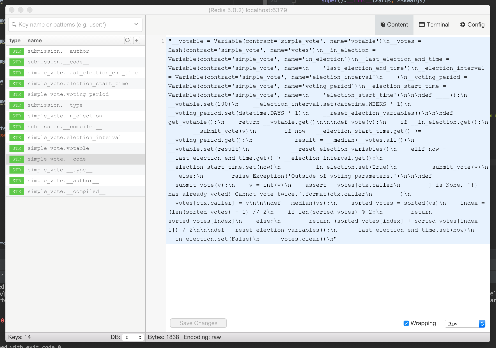

# Seneca - Smart Contracts with Python

```python
def token_contract():
    from seneca.libs.datatypes import hmap

    balances = hmap('balances', str, int)

    @export
    def balance_of(wallet_id):
        return balances[wallet_id]

    @export
    def transfer(to, amount):
        balances[rt['sender']] -= amount
        balances[to] += amount
        sender_balance = balances[rt['sender']]

        assert sender_balance >= 0, "Sender balance must be non-negative!!!"

    @export
    def mint(to, amount):
        assert rt['sender'] == rt['author'], 'Only the original contract author can mint!'
        balances[to] += amount
```

### Installing

```
git clone https://github.com/Lamden/seneca.git
cd seneca
git pull origin dev
python3 setup.py develop

brew install redis
brew services start redis
```

### Using Seneca in a Development Enviroment
With Seneca now installed, you can develop smart contracts without an instance of the blockchain. This is to improve the speed of development. Unlike Solidity that requires a 3rd party service such as Truffle or TestRPC, we leverage existing Python tooling and provide the APIs to allow people to develop smart contracts with ease out of the box. Here is how you would go about testing a token contract in a Jupyter notebook / IPython console:

```python
In [1]: from seneca.tooling import *

In [2]: def token_contract():
   ...:     from seneca.libs.datatypes import hmap
   ...:
   ...:     balances = hmap('balances', str, int)
   ...:
   ...:     @export
   ...:     def balance_of(wallet_id):
   ...:         return balances[wallet_id]
   ...:
   ...:     @export
   ...:     def transfer(to, amount):
   ...:         balances[rt['sender']] -= amount
   ...:         balances[to] += amount
   ...:         sender_balance = balances[rt['sender']]
   ...:
   ...:         assert sender_balance >= 0, "Sender balance must be non-negative!!!"
   ...:
   ...:     @export
   ...:     def mint(to, amount):
   ...:         assert rt['sender'] == rt['author'], 'Only the original contract author can mint!'
   ...:         balances[to] += amount
   ...:

In [3]: d = default_driver()
   ...: d.r.flushdb()
Out[3]: True

In [4]: d.publish_function(token_contract, contract_name='token', author='stu')

In [5]: token = ContractWrapper('token', default_sender='stu')

In [6]: token.mint(to='stu', amount=100000)
Out[6]: {'status': 'success', 'output': None, 'remaining_stamps': 0}

In [7]: token.balance_of(wallet_id='stu')
Out[7]: {'status': 'success', 'output': Decimal('100000'), 'remaining_stamps': 0}
```

### Storage Model
Seneca uses Redis to store the state of the blockchain. Thus, you can use any Redis tooling to inspect the storage and retrieval of information to and from your smart contracts.

You can also use a GUI like Medis without any issue.


