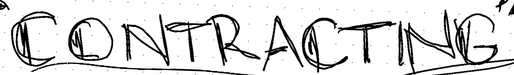

# Contracting - Smart Contracts on Lamden


Contracting is the name of Lamden's smart contracting library. Unlike Bitcoin and Ethereum, Lamden leverages the existing PythonVM to create a system that allows developers to write small applications for the  types of logic we see in smart contracts today. This generally has to do with simple logical transactions. Contracting focuses on making standard CRUD operations extremely easy with full support for JSON objects and dynamic storage sizing so you spend less time with lower level computer science details and more time coding.

### Example
```python
def token_contract():
     balances = Hash()
     owner = Variable()
     
     @construct
     def seed():
         owner.set(ctx.caller)

     @export
     def balance_of(wallet_id):
         return balances[wallet_id]

     @export
     def transfer(to, amount):    
         sender_balance = balances[ctx.caller]

         assert sender_balance >= 0, "Sender balance must be non-negative!!!"
         
         balances[ctx.caller] -= amount
         balances[to] += amount

     @export
     def mint(to, amount):
         assert ctx.caller == owner.get(), 'Only the original contract author can mint!'
         balances[to] += amount

```

### Installing

`pip install contracting`


### Prerequisites
Contracting assumes you have a MongoDB instance running with total open access. If you are running Contracting in production, do not expose the MongoDB or modify the code so that you have tighter controls over who uses the system. Contracting was made for developing smart contracts and pushing them to Lamden's blockchain first. Alternative applications may have security risks associated with it.

### Docs & More
Official docs and walkthrough are available [here](http://contracting.lamden.io).

Our team has produced a great walk-through for beginners which you can checkout [here](https://blog.lamden.io/smart-contracting-with-python-2af233620dca?gi=308f31362a75).